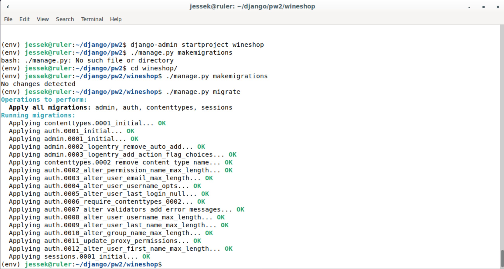

# pw2 ListView

Tämä raportti on Tero Karvisen ohjaaman [Python Web Service From Idea to Production](https://terokarvinen.com/2021/python-web-service-from-idea-to-production-2022/#pw1-hello-dj-a) kurssin toisen päivän tehtäviin.

## A. Tee alusta lähtien uusi Django-projekti. Tee siihen sivu, joka listaa tietueita tietokannasta ilman kirjautumista. Valitse jokin muu aihe kuin aiemman esimerkin CRM. Aivan simppeli esimerkkiprojekti riittää, mutta valitse sille jokin esimerkkiaihe.

Ajatuksenani oli tehdä projekti jolla voidaan listata eri viinejä.

Aloitetaan käynnistämällä virtualenv `source env/bin/activate` ja luomalla uusi projekti komennolla. `django-admin startproject wineshop`  Tehdään myös migraatiot, että saadaan valmis admin-paneeli meidän weppisivulle. `./manage.py makemigrations` `./manage.py migrate`

Luodaan vielä superuser, että pääsemme käsiksi juuri luotuun paneeliin. `./manage.py createsuperuser` ja lisäksi luodaan uusi taulu meidän tietokantaan. `./manage.py startapp winelist` `micro wineshop/settings.py`

Luodaan meille uusi viini olio, ajetaan migraatiot ja katsotaan tilanteen toimivuus (jonka olisi pitänyt tehdä aikaisemmin jo mutta unohtui).

Lisätään uudelle sivulle nyt muutama viini.

Seuraavaksi kasaillaan listaus siten, että kirjautumista ei vaadita. En ole varma teenkö nämä nyt "oikeassa" järjestyksessä tai onko edes oikeaa, mutta kokeillaan. Tässä käytän vahvasti apuna Teron tunnilla antamaa esimerkkiä. 

Lopuksi vielä kokeillaan listaako tämä, minun aikaisemmin lisäämäni viinit.

Tätä voisi vielä hienosäätä siten, että näkyisi vielä viinien muut tiedot ja ne tulisi nätimmin esille. Osaaminen ja aika ei vain nyt anna periksi.

## Lähteet
[Django 4 Instant Customer Database Tutorial](https://terokarvinen.com/2022/django-instant-crm-tutorial/)\
[Python Web Service From Idea to Production](https://terokarvinen.com/2021/python-web-service-from-idea-to-production-2022/#pw1-hello-dj-a)
